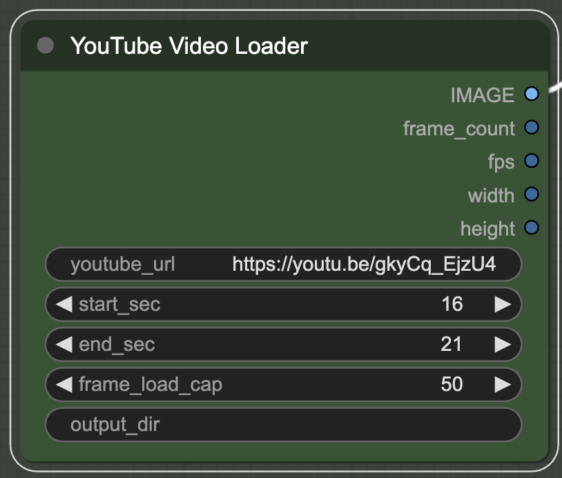

# komojini-comfyui-nodes
Custom ComfyUI Nodes for video generation

## Nodes
### YouTube Video Loader
Able to load and extract video from youtube.

### Image Merger
Able to merge 2 images or videos side by side.
Useful to see the results of img2img or vid2vid.

divide_points: 2 points that creates a line to be splitted.
One point will be like (x, y) and the points should be seperated by ";".
for "x" and "y", you can use int (pixel) or with %.
e.g. 
- (50%, 0);(50%, 100%) -> split by vertical line in the center
- (0%, 50%);(100%, 50%) -> split by horizontal line in the center
- (40%, 0);(70%, 100%) ->

